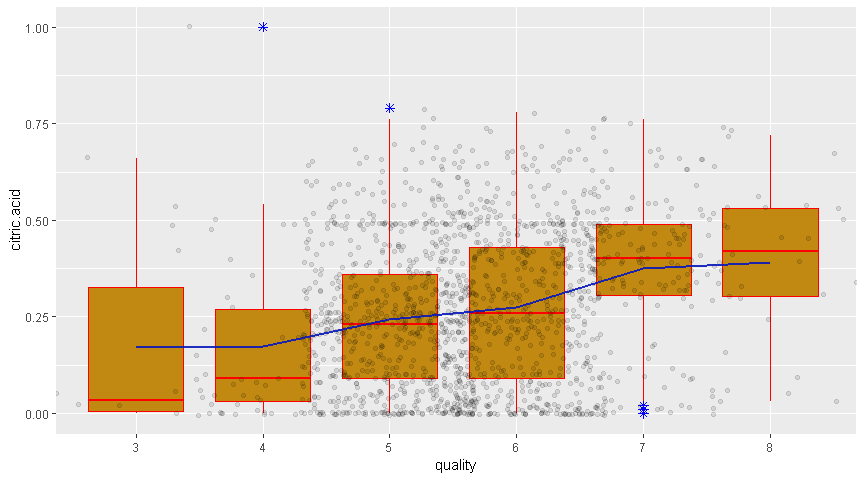
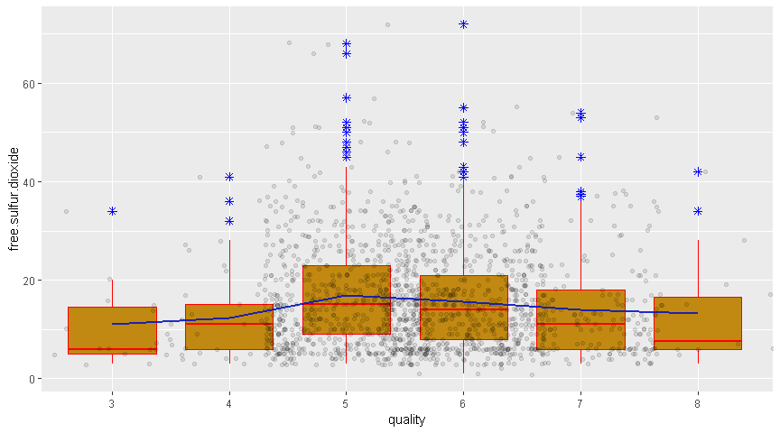
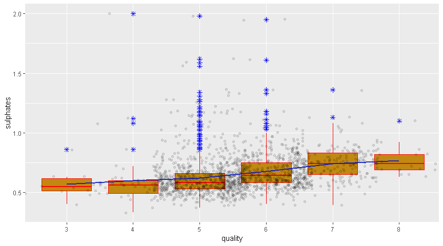
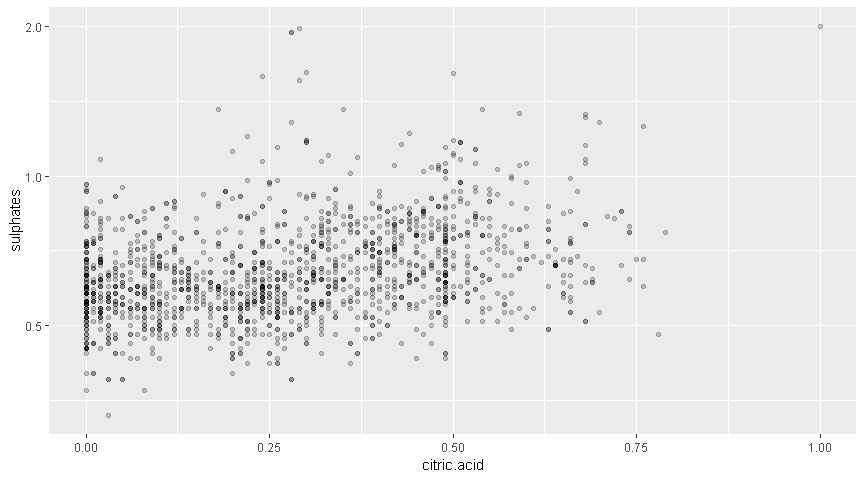

# Introduction

This project leverages R and exploratory data analysis to analyze a  dataset that aims to compare the quality of wine looking at different constituent elements contained within it

The data analyzed can be sourced from <a href="https://www.google.com/url?q=https://s3.amazonaws.com/udacity-hosted-downloads/ud651/wineQualityReds.csv&sa=D&ust=1537996947818000">Here</a>


> Within the dataset, i will be exploring various elements and how they affect the overall quality of the wine 

# Univariate Plots Section

```
## Observations: 1,599
## Variables: 12
## $ fixed.acidity        <dbl> 7.4, 7.8, 7.8, 11.2, 7.4, 7.4, 7.9, 7.3, ...
## $ volatile.acidity     <dbl> 0.700, 0.880, 0.760, 0.280, 0.700, 0.660,...
## $ citric.acid          <dbl> 0.00, 0.00, 0.04, 0.56, 0.00, 0.00, 0.06,...
## $ residual.sugar       <dbl> 1.9, 2.6, 2.3, 1.9, 1.9, 1.8, 1.6, 1.2, 2...
## $ chlorides            <dbl> 0.076, 0.098, 0.092, 0.075, 0.076, 0.075,...
## $ free.sulfur.dioxide  <dbl> 11, 25, 15, 17, 11, 13, 15, 15, 9, 17, 15...
## $ total.sulfur.dioxide <dbl> 34, 67, 54, 60, 34, 40, 59, 21, 18, 102, ...
## $ density              <dbl> 0.9978, 0.9968, 0.9970, 0.9980, 0.9978, 0...
## $ pH                   <dbl> 3.51, 3.20, 3.26, 3.16, 3.51, 3.51, 3.30,...
## $ sulphates            <dbl> 0.56, 0.68, 0.65, 0.58, 0.56, 0.56, 0.46,...
## $ alcohol              <dbl> 9.4, 9.8, 9.8, 9.8, 9.4, 9.4, 9.4, 10.0, ...
## $ quality              <ord> 5, 5, 5, 6, 5, 5, 5, 7, 7, 5, 5, 5, 5, 5,...
```
The  dataset comprises 12 variables, with 1599 observations.The  Quality variable is discrete and the others are continuous

## Quality


```
##   3   4   5   6   7   8 
##  10  53 681 638 199  18
```


```
## geom_bar: width = NULL, na.rm = FALSE
## stat_count: width = NULL, na.rm = FALSE
## position_stack
```

From the histogram, it can be infered that having combined the constituent elements that form red wine in different rations, most end with a quality of  between 5 & 6(median quality).The histogram also shows that no wines exist with a quality worse than 3 and no wines within the dataset have quality higher than 8.

## Fixed Acidity


```
##    Min. 1st Qu.  Median    Mean 3rd Qu.    Max. 
##    4.60    7.10    7.90    8.32    9.20   15.90
```


The fixed acidity of the wines fall on a median of  7.90 $g/dm^3$. A larger proportion of the wines have a median fixed acidity falling between 7.10 and 9.20 as such the distribution of fixed acidity is slightly tends to the right of the chart. A few outliers exist a beyond the 14 fixed acidity range

## Volatile acidity


```
##    Min. 1st Qu.  Median    Mean 3rd Qu.    Max. 
##  0.1200  0.3900  0.5200  0.5278  0.6400  1.5800
```


A few outliers exist towards the end of the scale. The volatile acidity is non-symmetric and bimodal with two peaks at 0.39 and 0.64. The median value is 0.52. Most observations fall within the areas of the peak which ranges between 0.39 to 0.64. 

## Citric acid

`

```
##    Min. 1st Qu.  Median    Mean 3rd Qu.    Max. 
##   0.000   0.090   0.260   0.271   0.420   1.000
```


Most wines have less than 1 $g/dm^3$ of citric acid.The data & consequently the chart  shows that only a small quantity of citric acid is used. The distribution tends to the right with some highs & lows.A single outlier exists on the right side containing 1 $g/dm^3$ of citric acid.This is absolutely normal as only a little amount of citric acid is neccessary to improve freshness and flavour for wines.

## Residual sugar


```
##    Min. 1st Qu.  Median    Mean 3rd Qu.    Max. 
##   0.900   1.900   2.200   2.539   2.600  15.500
```


The distribution of residual sugar has a median value of 2.2 $g/dm^3$ and there is a major trend toward the right of the chart depicting an increase in residual sugar beyond the median point. Also,there are many outliers on the right side of the main peak.I believe this is because for improved alcohol levels, more sugar will be needed during fermentation & thus leading to higher chances of having residual sugar. 

## Chlorides


```
##    Min. 1st Qu.  Median    Mean 3rd Qu.    Max. 
## 0.01200 0.07000 0.07900 0.08747 0.09000 0.61100
```


The amount of chlorides in the wines has a median value of 0.079 $g/dm^3$. A few outliers exists beyound the 0.28$g/dm^3$ The chlorides level are relatively little within the wine probably because a high value means higher salt levels.

## Free sulfur dioxide


```
##    Min. 1st Qu.  Median    Mean 3rd Qu.    Max. 
##    1.00    7.00   14.00   15.87   21.00   72.00
```


The distribution of free sulfur dioxide concentrations is skewed to the right with increased concentration seen around the median region of 14 $mg/dm^3$.The amount of sulfur dioxide is largely infinitesimal as you approach the 56$mg/dm^3$ mark with a few outliers noticed between 65$mg/dm^3$ & 72$mg/dm^3$

## Total sulfur dioxide


```
##    Min. 1st Qu.  Median    Mean 3rd Qu.    Max. 
##    6.00   22.00   38.00   46.47   62.00  289.00
```


The concentration of total sulfur dioxide declines as we move towards the right hand side of the concentrate. A median value of 38 $mg/dm^3$ is noticed with two wines having a concentration of total sulphur dioxide greater than 200 $mg/dm^3$

## Density


```
##    Min. 1st Qu.  Median    Mean 3rd Qu.    Max. 
##  0.9901  0.9956  0.9968  0.9967  0.9978  1.0037
```


The wines exhibit different densities which fall between 0.9956 and 0.9967 $g/cm^3$. The distribution tends to be symmetric and has a median value of 0.9968 $g/cm^3$. 

## pH


```
##    Min. 1st Qu.  Median    Mean 3rd Qu.    Max. 
##   2.740   3.210   3.310   3.311   3.400   4.010
```


Wines tend to be more acidic than alkalinic hence justifying the low pH within the analysis. From Research, Low pH wines will taste tart and crisp, while higher pH wines are more susceptible to bacterial growth. Most wine pH levels fall around 3 or 4; about 3.0 to 3.4 is desirable for white wines, while about 3.3 to 3.6 is best for reds. As such the median value of 3.3 pH depicted within this analysis is absolutely normal. The text attached to this project also gives credence to this as it states that most wines have a pH of between 3-4.


## Sulphates


```
##    Min. 1st Qu.  Median    Mean 3rd Qu.    Max. 
##  0.3300  0.5500  0.6200  0.6581  0.7300  2.0000
```


The sulphates used across the cross section of wines sampled shows a certain trend for higher sulphate values in wines with a major proportion having sulphate values with less than 1 $g/dm^3$. Although a few outliers exist with sulphate values above 1.2 $g/dm^3$ however the median value of sulphates is 0.62 $g/dm^3$ and most wines have a concentration between 0.55 $g/dm^3$ and 0.73 $g/dm^3$.Sulphate assists with antioxidation which leads to better storage.

## Alcohol


```
##    Min. 1st Qu.  Median    Mean 3rd Qu.    Max. 
##    8.40    9.50   10.20   10.42   11.10   14.90
```


The alcohol concentration for wine often depends on the manufacturer of the wine. Redwine tends to have an alcohol content between 10- 14% which is synonymous with what obtains within the analysis where we see majority of the wines analyzed with an alcohol content between 8 & 14%.some outliers exist with an alcohol content of 14.90%

##  Univariate Analysis Report

### What is the structure of your dataset?

The  dataset comprises 12 variables, with 1599 red wines.Properties depicted within the dataset include fixed.acidity, volatile.acidity, citric.acid, residual.sugar, chlorides, free.sulfur.dioxide, total.sulfur.dioxide, density, pH, sulphates, alcohol, and quality.Most median values generated within the dataset are synonymous with real world properties of wine.

### What is/are the main feature(s) of interest in your dataset?
The pH & Quality of the wine are the main features of interest. Also, i'm a bit interested about the impact of removing constituents like sulphates and citric form the wine and how it will affect the quality since very little quantities of them are used.

### What other features in the dataset do you think will help support your?
I think it will be great to know how certain elements impact the quality of the wine as most red wines analyzed had an alcohol quantity of less than 15%. Would increasing certain elements affect the quality of the wine?

### Did you create any new variables from existing variables in the dataset?
No i did not

### Of the features you investigated, were there any unusual distributions? 
The data seemed great and I did not notice any unusual distributions


# Bivariate Plots Section


## alcohol vs. Quality

```
## [1] "Median of alcohol by quality:"
## wines$quality: 3
## [1] 9.925
## -------------------------------------------------------- 
## wines$quality: 4
## [1] 10
## -------------------------------------------------------- 
## wines$quality: 5
## [1] 9.7
## -------------------------------------------------------- 
## wines$quality: 6
## [1] 10.5
## -------------------------------------------------------- 
## wines$quality: 7
## [1] 11.5
## -------------------------------------------------------- 
## wines$quality: 8
## [1] 12.15
```


As the alcohol level increases, an increase in quality is also noticed. It is often percieved that the higher the alcohol level, the higher the quality of the wine.This is synpnmous with trends noticed in the chart.


## pH vs. Quality

```
## [1] "Median of pH by quality:"
## wines$quality: 3
## [1] 3.39
## -------------------------------------------------------- 
## wines$quality: 4
## [1] 3.37
## -------------------------------------------------------- 
## wines$quality: 5
## [1] 3.3
## -------------------------------------------------------- 
## wines$quality: 6
## [1] 3.32
## -------------------------------------------------------- 
## wines$quality: 7
## [1] 3.28
## -------------------------------------------------------- 
## wines$quality: 8
## [1] 3.23
```


As the pH reduces, the quality of the wine increases.This is absolutely normal as in real live scenarios where pH levels of 3.3 are advised for red wine.  


## Volatile Acidity vs. Quality


```
## [1] "Median of volatile.acidity by quality:"
## wines$quality: 3
## [1] 0.845
## -------------------------------------------------------- 
## wines$quality: 4
## [1] 0.67
## -------------------------------------------------------- 
## wines$quality: 5
## [1] 0.58
## -------------------------------------------------------- 
## wines$quality: 6
## [1] 0.49
## -------------------------------------------------------- 
## wines$quality: 7
## [1] 0.37
## -------------------------------------------------------- 
## wines$quality: 8
## [1] 0.37
```


The trend depicts a higher wine quality as volatile acidity decreases. This is absolutely normal as a higher acetic acidity level leads to unpleasant vinegar taste in wines


## citric.acid vs. Quality

```
## [1] "Median of citric.acid by quality:"
## wines$quality: 3
## [1] 0.035
## -------------------------------------------------------- 
## wines$quality: 4
## [1] 0.09
## -------------------------------------------------------- 
## wines$quality: 5
## [1] 0.23
## -------------------------------------------------------- 
## wines$quality: 6
## [1] 0.26
## -------------------------------------------------------- 
## wines$quality: 7
## [1] 0.4
## -------------------------------------------------------- 
## wines$quality: 8
## [1] 0.42
```



The trend depicts a higher wine quality as concentration of citric acidity increases.citic acid adds flavour and freshness to wines


## fixed acidity vs. Quality

```
## [1] "Median of fixed.acidity by quality:"
## wines$quality: 3
## [1] 7.5
## -------------------------------------------------------- 
## wines$quality: 4
## [1] 7.5
## -------------------------------------------------------- 
## wines$quality: 5
## [1] 7.8
## -------------------------------------------------------- 
## wines$quality: 6
## [1] 7.9
## -------------------------------------------------------- 
## wines$quality: 7
## [1] 8.8
## -------------------------------------------------------- 
## wines$quality: 8
## [1] 8.25
```


There seems to be a direct correlation between increased acidity levels and wine quality however the wines that have a quality of 8 seem to negate this trend. A  big dispersion of acidity values is noticed across each quality scale. This may be a indicator that the quality cannot be predicted based only on the value of acidity and is the result of a combination of more variables.

## residual.sugar vs. Quality

```
## [1] "Median of residual.sugar by quality:"
## wines$quality: 3
## [1] 2.1
## -------------------------------------------------------- 
## wines$quality: 4
## [1] 2.1
## -------------------------------------------------------- 
## wines$quality: 5
## [1] 2.2
## -------------------------------------------------------- 
## wines$quality: 6
## [1] 2.2
## -------------------------------------------------------- 
## wines$quality: 7
## [1] 2.3
## -------------------------------------------------------- 
## wines$quality: 8
## [1] 2.1
```


The amount of residual sugar used seems to have a low impact on the quality of the wine.

## chlorides vs. Quality

```
## [1] "Median of chlorides by quality:"
## wines$quality: 3
## [1] 0.0905
## -------------------------------------------------------- 
## wines$quality: 4
## [1] 0.08
## -------------------------------------------------------- 
## wines$quality: 5
## [1] 0.081
## -------------------------------------------------------- 
## wines$quality: 6
## [1] 0.078
## -------------------------------------------------------- 
## wines$quality: 7
## [1] 0.073
## -------------------------------------------------------- 
## wines$quality: 8
## [1] 0.0705
```


A higher quality is observed with reduced concentration of chlorides. This is normal as increased chloride levels means increased saltiness

## free.sulfur.dioxide vs. Quality

```
## [1] "Median of free.sulfur.dioxide by quality:"
## wines$quality: 3
## [1] 6
## -------------------------------------------------------- 
## wines$quality: 4
## [1] 11
## -------------------------------------------------------- 
## wines$quality: 5
## [1] 15
## -------------------------------------------------------- 
## wines$quality: 6
## [1] 14
## -------------------------------------------------------- 
## wines$quality: 7
## [1] 11
## -------------------------------------------------------- 
## wines$quality: 8
## [1] 7.5
```



The box plot trend depicts an increased amount of quality as free sulphur dioxide increases however the trends tends to vary as the free sulphur dioxide concentration goes beyond the 50 $g/dm^3$. There is a possibility that it is only at this concentration level that  sulphur dioxide becomes detectable within a mixture or at this point, it achieves equilibrum and would not affect the quality of the wine.

## total.sulfur.dioxide vs. Quality

```
## [1] "Median of total.sulfur.dioxide by quality:"
## wines$quality: 3
## [1] 15
## -------------------------------------------------------- 
## wines$quality: 4
## [1] 26
## -------------------------------------------------------- 
## wines$quality: 5
## [1] 47
## -------------------------------------------------------- 
## wines$quality: 6
## [1] 35
## -------------------------------------------------------- 
## wines$quality: 7
## [1] 27
## -------------------------------------------------------- 
## wines$quality: 8
## [1] 21.5
```


The same trend with free sulphur dioxide applies within the total sulphur dioxide scenario. The box plot trend tends to vary as the sulphur dioxide concentration goes beyond the 50 $g/dm^3$.

## density vs. Quality

```
## [1] "Median of density by quality:"
## wines$quality: 3
## [1] 0.997565
## -------------------------------------------------------- 
## wines$quality: 4
## [1] 0.9965
## -------------------------------------------------------- 
## wines$quality: 5
## [1] 0.997
## -------------------------------------------------------- 
## wines$quality: 6
## [1] 0.99656
## -------------------------------------------------------- 
## wines$quality: 7
## [1] 0.99577
## -------------------------------------------------------- 
## wines$quality: 8
## [1] 0.99494
```


The lower the density of the wine, the higher the quality. This is as it should be as wine should be soft and smooth.Other factors may also determine this which include concentration of other elements used

## sulphates vs. Quality

```
## [1] "Median of sulphates by quality:"
## wines$quality: 3
## [1] 0.545
## -------------------------------------------------------- 
## wines$quality: 4
## [1] 0.56
## -------------------------------------------------------- 
## wines$quality: 5
## [1] 0.58
## -------------------------------------------------------- 
## wines$quality: 6
## [1] 0.64
## -------------------------------------------------------- 
## wines$quality: 7
## [1] 0.74
## -------------------------------------------------------- 
## wines$quality: 8
## [1] 0.74
```



An increased quality is noticed with higher concentration of sulphates and ofcus as the text states, sulphates are neccessary for wine storage(antioxidation) which guarantees wine quality when proper volumes are used.

## citric.acid vs. Sulphates



Both appear to move in tangem with each other although it appears that twice the amount of sulphates is needed per citric acid constituent.

## alcohol vs. Density


The density does not determine the alcohol level.

## fixed acidity vs. pH


As it should be,the higher the acidity level, lower the pH level.

## alcohol vs. residual.sugar


A higher alcohol level is noticed with increased amount of residual sugar. This is normal as alcohol constituents are sometimes achieved by fermentation of sugar and the more sugar you have the more alcohol percentages you can achieve however, it is important to ensure appropriate levels of sugar are used to reduce the amount of residual sugar left after fermentation

## Correlations with Quality


```
##                             [,1]
## fixed.acidity         0.11408367
## volatile.acidity     -0.38064651
## citric.acid           0.21348091
## residual.sugar        0.03204817
## chlorides            -0.18992234
## free.sulfur.dioxide  -0.05690065
## total.sulfur.dioxide -0.19673508
## density              -0.17707407
## pH                   -0.04367193
## sulphates             0.37706020
## alcohol               0.47853169
```

It is important to test which elements contribute the most to the quality of the wine and using spearman's correlation coefficient we are able to see that an increase in certain elements help us achieve a higher wine quality.

## Bivariate analysis report

### Some of the relationships I observed within the Bivariate analysis.

 - The lower the density of the wine, the higher the quality. 
 - To achieve, a higher quality of wine, the following must be watched closesly: Fixed acidity, citric acid quantity, residual sugar quantity, sulphates & alcohol level.
 - The density does not determine the alcohol level

 
### Did you observe any interesting relationships between the other features.

- Alcohol level increases as the amount of residual sugar used increases largely because sugar is neccessary for fermentation and for the achievement of alcohol levels.  There  are increased chances of having residual sugar as the amount of sugar used for fermentation increases.
- Initially i thought that, both citric acid and sulphates had to be used in the same proportion but i was able to detect that twice the amount of sulphates is needed per citric acid constituent.
- I also observed the relationship between the pH and acidity level were as expected.
 - Amount of free sulfur dioxide & Total sulphur dioxide needed to be used initially increases as one strives to achieve a higher quality but then falls after a quality level of 5 has been achieved. It is possible that there is a threshold amount required to be used to achieve quality beyond which the constituent amount needed can begin to drop after a certain quality has been achieved or the element becomes undetected after certain concetration levels.
 
### What was the strongest relationship you found?

- The quality of red wine is determined hugely by its alcohol level

# Multivariate Plots Section


## Density, volatile acidity and quality


We can see that lowest qualities are noticeable at higher acidic level while the best are noticeable at lower acidic levels. The density does not seem to have an impact on quality. Density is majorly a function of sugar and alcohol levels

## Alcohol, fixed.acidity, quality


Higher alcohol & lower acidity levels give better wines. This is distinctly noticeable from the wine with an alcohol level of 14% & a fixed acidity of about 3 $g/dm^3$

## Alcohol, residual sugar, quality


Although in ordinary terms, sugar helps with fermentation, but in light of the fact that the wine is not supposed to be sweet, the residual sugar left after fermentation has occured is expected to be low as best quality wines are found to have lower residual sugar levels and high alcohol levels

wines with higher quality have a low residual sugar conent and high alcoholic content

## Citric acid, sulphates and quality


The wines with the best qualities have a varying citric acid level with sulphate levels sparring between 0.53 & 1 $g/dm^3$. The citric acid levels are also existent in small volumes less than 1 $g/dm^3$. Sulphates used also vary around the 1 $g/dm^3$

The citric acid and sulphates used must be in small quantities and the sulphates used may be double the amount of citric acid needed.

## free sulphur dioxide, total sulphur dioxide


Free sulfur dioxide and total sulphur dioxide seem to have positive correlation with each other

## Multivariate Analysis Report

###  some of the relationships I observed in this part of the analysis.
 
- As much as sulphates and citric acid are important to help with storage and improving freshness, only a small amount are required for high quality wines
- wines with higher quality have a low residual sugar conent and high alcoholic content
-  Higher alcohol & lower acidity levels give better wines.
- Free sulfur dioxide and total sulphur dioxide seem to have a positive correlation with each other

### Were there any interesting or surprising interactions between features?

- The density did not seem to have as much an impact on wine quality as compared to the impact that the volatile acidity level had

------

# Final Plots and Summary

### Plot One

```
## [1] "Median of free.sulfur.dioxide by quality:"
## wines$quality: 3
## [1] 6
## -------------------------------------------------------- 
## wines$quality: 4
## [1] 11
## -------------------------------------------------------- 
## wines$quality: 5
## [1] 15
## -------------------------------------------------------- 
## wines$quality: 6
## [1] 14
## -------------------------------------------------------- 
## wines$quality: 7
## [1] 11
## -------------------------------------------------------- 
## wines$quality: 8
## [1] 7.5
```


I find it particularly interesting that as free sulphur dioxide concentration increased,  quality increased up until when we achieved a 50 $g/dm^3$ volume of free sulphur dioxide and then quality keeps increasing even as the free sulphur dioxide levels dropped. This also applies to the total sulphur dioxide trends


### Plot Two


I find it interesting that even though high volumes of sugar is neccessary for improved alcohol level in view of the neccessary fermentation process, we have to be careful that we keep it at an equilibrum level to ensure a lot of residual sugar is not left and the required amount of alcohol levels are achieved to ensure high wine quality

### Plot Three

```
## [1] "Median of alcohol by quality:"
## wines$quality: 3
## [1] 9.925
## -------------------------------------------------------- 
## wines$quality: 4
## [1] 10
## -------------------------------------------------------- 
## wines$quality: 5
## [1] 9.7
## -------------------------------------------------------- 
## wines$quality: 6
## [1] 10.5
## -------------------------------------------------------- 
## wines$quality: 7
## [1] 11.5
## -------------------------------------------------------- 
## wines$quality: 8
## [1] 12.15
```


I would have thought before this analysis that alcohol levels in a wine was only a function of what the wine manufacturer wants and not a true determinant of quality but the analyis tends to prove otherwise


------

# Reflection

The project in all was quite interesting as I was able to learn how certain elements affect the quality of red wine. Analyzing how 12 attributes affect the quality of wine having compared about 1599 different wine sammples helped me understand the intricacies that go into wine preperation.

Notable lessons include
- The impact of sugar on wine quality and how residual sugar impacts the taste of wine.

- The relationship between acidic levels and how it can make a wine sample taste rather unpleasantly when overtly acidic.

- The relationship between sulphate and citric acidic levels and how they impact the storage life & taste of wine when used in small forms.

- The impact and relevance of chlorides and how they impact saltiness of wine hence must be used in small units.

- The fact that there is an equilibrum amount for sulphur oxide constituents of wine.

- The fact that alcohol level is a true determinant of wine quality.

The analysis allows for machine learning models to be created to automatically detect the quality of wine that will be produced when varying ratios of constituents elements are used without really having to create the wine. This if harnessed properly will enable  producers create varying taste & qualities of wine digitally before actually really creating the real wine.

# References
- https://s3.amazonaws.com/udacity-hosted-downloads/ud651/wineQualityInfo.txt
- https://winefolly.com/review/wine-characteristics/
- https://www.winespectator.com/drvinny/show/id/5035


